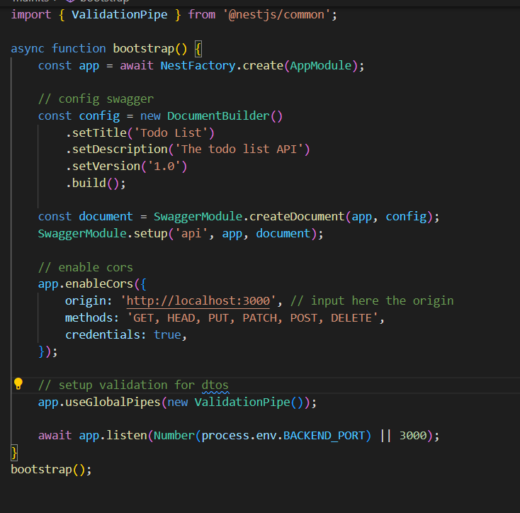
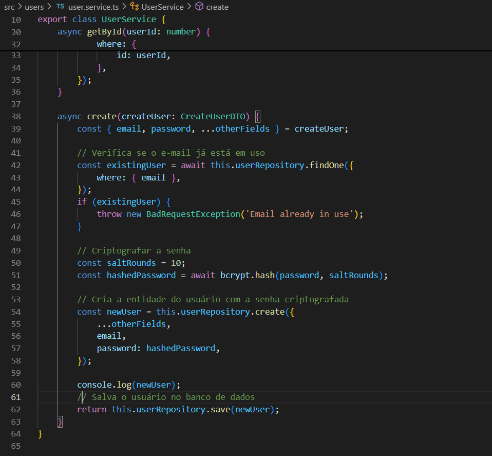
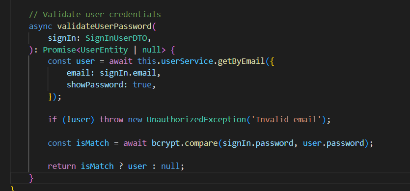

# Como usar o código
1. Abra o código na raiz do projeto e abra o terminal e execute o comando `npm i` ou `npm install` para instalar todas as dependências do projeto.
2. Em seguida, execute configure o arquivo `.env.development.local` ou `.env.production.local` - o `.env.development.local` tem precedência sobre o último:
```
DB_USER=usuário do banco de dados
DB_HOST=o local em que o banco está rodando
DB_POST=a porta em que o banco está rodando
DB_PASS=a senha do usuário
DB_NAME=o nome do banco de dados
DB_SCHEMA=o esquema do banco de dados

BACKEND_PORT=a porta em que o backend vai rodar

JWT_SECRET=a senha para gerar o access token
```
4. Caso você tenha o `Docker`, crie o arquivo `.env.docker-db` e o configure com as seguintes variáveis:
```
POSTGRES_USER=usuário do banco de dados
POSTGRES_PASSWORD=senha do usuário do banco de dados
POSTGRES_DB=nome do banco de dados
```
 - A variável `POSTGRES_USER`, `POSTGRES_PASSWORD` e `POSTGRES_DB` devem ser iguais, respectivamente, a `DB_USER`, `DB_PASS` e `DB_NAME`.
5. Verifique se em sua máquina tem `PostgreSQL`, caso não tenha e tenha `Docker`, execute os seguintes comandos:
    - `container-db:run`: para criar o *container* com o banco de dados
    - `container-db:stop`: para encerrar a execução do *container*
    - `container-db:start`: para recomeçar o *container* do banco de dados
6. Por fim, execute as *migrations* para preparar o banco de dados em sua máquina usando o comando `npm run migration:run`
7. Para rodar o código use o comando `npm run start:prod` ou `npm run start:dev`

# Explicando o código

Trata-se de um projeto de back-end para uma aplicação de lista de fazer usando o *framework* NestJS. Há um sistema de autenticação que funciona da seguinte forma:
1. O front-end enviará uma requisição pela rota `auth/sign-up` usando o método *POST*
2. O back-end fará a validação do corpo da requisição por meio dos `dto`, em decorrência da linha 27 do arquivo [src/main.ts](/src/main.ts):

3. Caso o corpo seja validado, então, será feito o *hashed* da senha de forma aleatória usando a biblioteca `bcrypt`

4. Uma vez que o usuário está registrado, é possível enviar uma requisição a rota `auth/sign-in` usando o método *POST*. Então, será comparada a senha enviada com o *hash* da senha registrado.

5. Após a comparação, será feito um `JSON Web Token` com base no segredo atribuído a variável de ambiente `JWT_SECRET` (caso não informado, o segredo será: default_secret)

7. Com esse `JSON Web Token` é possível atribuir `authorization` as requisições feitas as demais rotas do projeto.
8. Via de regra, as rotas são privadas, em virtude do `AuthhGuard`:

9. As rotas públicas são decoradas com o `decorator` `Public` que ativa a condição e faz retornar o valor booleano verdadeiro:


# [Documentação no POSTMAN](https://documenter.getpostman.com/view/21997570/2sAXqpAQ3i)